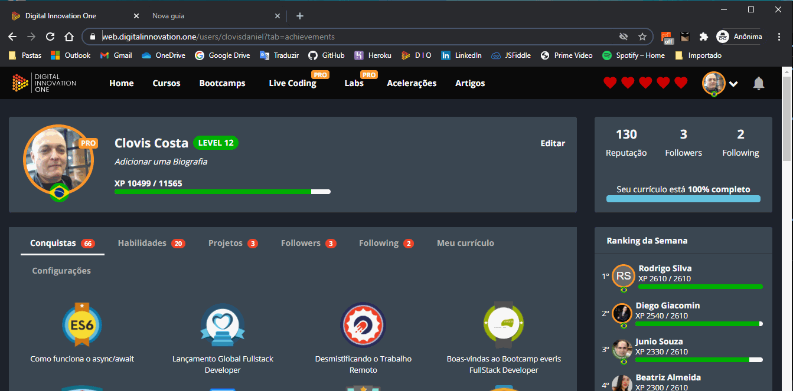

<h1 align="center">
:small_red_triangle_down: Consultation Weather Forecast by API in Angular 8
</h1>

  

<h2 align="center">
Bootcamp everis Fullstack Developer by Digital Innovation One
</h2>

  

  

The purpose of this project is created a Consultation Weather Forecast App with requests to Open Weather Map API.

  <a href="#rocket-technologies">Technologies</a>&nbsp;&nbsp;&nbsp;|&nbsp;&nbsp;&nbsp;
  <a href="#computer-installation">Installation</a>&nbsp;&nbsp;&nbsp;|&nbsp;&nbsp;&nbsp;
  <a href="#books-learning">Learning</a>&nbsp;&nbsp;&nbsp;|&nbsp;&nbsp;&nbsp;
  <a href="#small_orange_diamond-sharing">Sharing</a>&nbsp;&nbsp;&nbsp;|&nbsp;&nbsp;&nbsp;
  <a href="#small_orange_diamond-license">License</a>

  

## :rocket: Technologies
  To build this project the follow technologies were used:

  - [Html5](https://developer.mozilla.org/pt-BR/docs/Web/HTML/HTML5)
  - [Css3](https://www.w3schools.com/css/)
  - [TypeScript](https://www.typescriptlang.org/)
  - [Angular 8](https://angular.io/)
  - [Bootstrap](https://getbootstrap.com/)
  - [Material Design](https://material.angular.io/)
  - [Ngrx](https://ngrx.io/)
  - [Open Weather API](https://openweathermap.org/api)

## :computer: Installation

3. Clone this repository on your computer:

    `$ git clone https://github.com/clovisdanielcosta/angular-weather.git`

1. Enter in the project folder:

    `$ cd angular-weather`

1. To install dependencies needed run:

    `$ npm install`

2. To start application run:

    `$ ng serve`

5. Navigate to `http://localhost:4200/`. The app will automatically reload if you change any of the source files.

## :books: Learning

  - Excellent explanation on how to manage the state of the application.
  - Use of reducer to update the store, which is nothing more than a huge Json to keep the last state of the application.
  - The difference between reducers and effects is that they will also react to an action but are executed asynchronously because they are based on observables.

## :small_orange_diamond: Sharing

  - I concluded that it will take many more hours of study to upload the concept of Angular to my 'core'. Then, don't worry if you are a little or very lost in this course. Keep digging and you will obtain success.

## :small_orange_diamond: License

This project is under MIT license. Open file [LICENSE](LICENSE.md) to details. 
The images in this project were made by repo's owner or taken from another repo in the web with the right authorization of use.
